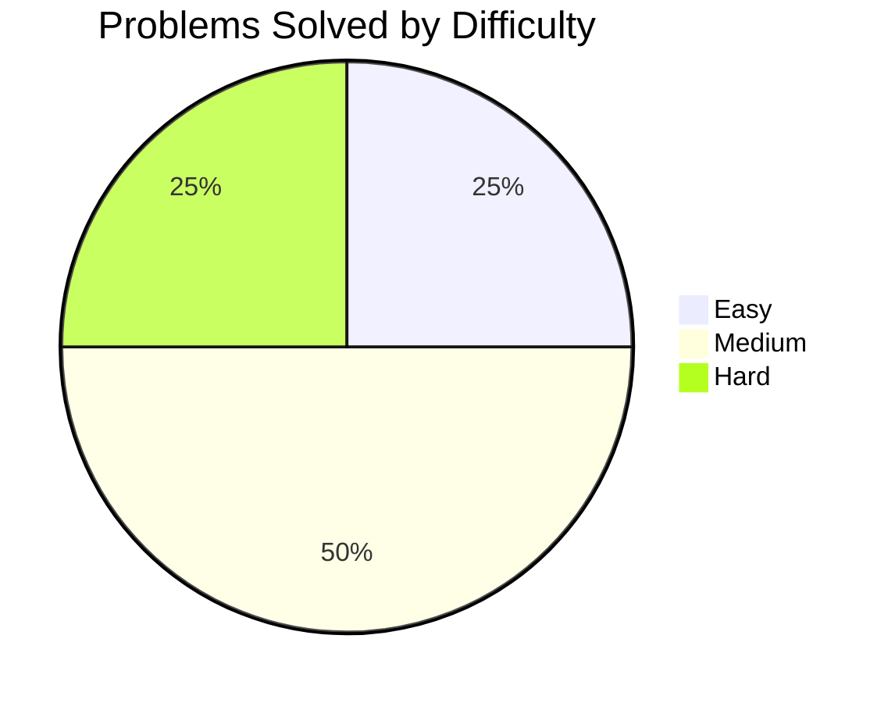

# LeetCode Problems

## 📊 Progress Stats

<table>
<tr>
<td>

### 🎯 Problems Solved: **1** / 3611

| Difficulty | Solved | Total | Progress |
|------------|--------|-------|----------|
| 🟢 **Easy** | 1 | 885 |  |
| 🟡 **Medium** | 0 | 1878 |  |
| 🔴 **Hard** | 0 | 848 |  |

</td>
<td width="300">

</td>
</tr>
</table>

---

## Problem Solutions

| Problem Number | Problem Name | Difficulty | Languages Solved |
|---------------|--------------|------------|------------------|
| 1 | [Two Sum](https://leetcode.com/problems/two-sum/description/) | 🟢 Easy | C++, JavaScript |

## Directory Structure

- [`leetCode/C++/`](https://github.com/ashifulalam/problem-solving/tree/master/leetCode/C%2B%2B) - C++ solutions
- [`leetCode/javascript/`](https://github.com/ashifulalam/problem-solving/tree/master/leetCode/javascript) - JavaScript solutions

<!--
TEMPLATE FOR ADDING NEW PROBLEMS (Only visible in edit mode):

problem number: 
problem name: 
problem url: 
difficulty: easy / medium / hard
Languages Solved: C++, JavaScript

HOW TO UPDATE PIE CHART:
When you solve problems, update the mermaid pie chart with actual numbers:
Example for 1 Easy, 2 Medium, 1 Hard:

And update percentages:
- Easy: 25% (1/4)
- Medium: 50% (2/4)  
- Hard: 25% (1/4)

Copy the format above when you solve a new problem and paste it to update the README!
-->
